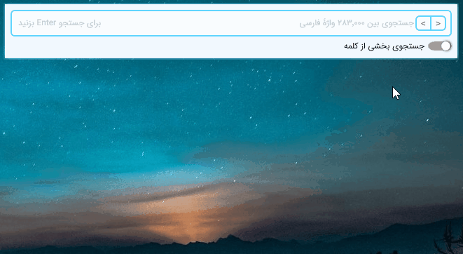

# Vajehdan

آدم‌ها فقط **جروبحث** نمی‌کنند؛ **بگومگو** می‌کنند، **مجادله** می‌کنند و گاهی **مرافعه** می‌کنند. غذای **خوشمزه**، **لذیذ** و **دلچسب** هم هست. می‌توان کسی را **بادل‌وجان** دوست داشت یا **خاطرخواه** و **شیدایش** بود. گاهی دلمان **عزم سفر** می‌کند و گاهی **آهنگ سفر** داریم. احتمالاً برای شما هم پیش آمده که حینِ نوشتن، دنبال کلمه‌ای بوده‌اید ولی هرچه تلاش کرده‌اید به خاطر نیاورده‌اید. این سرآغاز تولد واژه‌دان بود؛ برنامه‌ای که مترادف کلمات را از میان چند هزار واژۀ فارسی جستجو می‌کند و نتایج را آناً به شما نشان می‌دهد.
داستان شکل‌گیری ایده را می‌توانید [**اینجا**](https://virgool.io/@kokabi/Vajehdan-bgyys49ibopb) بخوانید.

