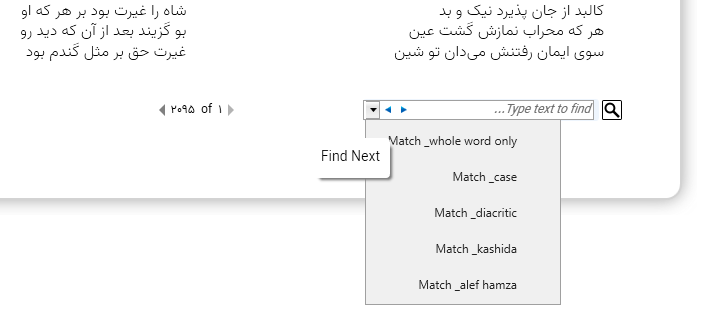
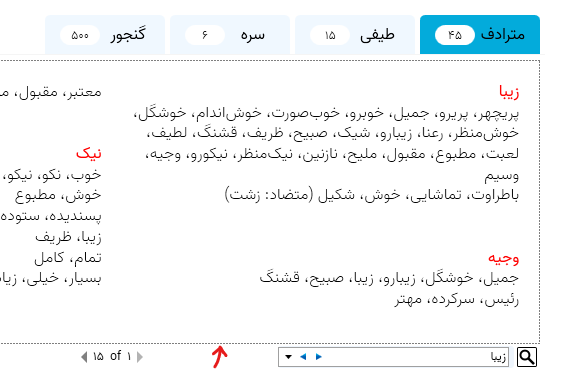

# واژه‌دان

**واژه‌دان** با جستجویِ سریع در لغت‌نامه‌هایِ معتبرِ فارسی کمک می‌کنه تا موقعِ نوشتن واژه کم نیارید یا به دامِ واژه‌هایِ تکراری نیفتید. با این برنامه می‌تونید مترادف و متضادِ کلماتِ فارسی و واژه‌هایی که به هر نحوی با هم در ارتباط هستند رو پیدا کنید. می‌تونید بینِ حجمِ عظیمی از اشعارِ فارسی جستجو کنید. می‌تونید از سرهم‌نویسی یا جدانویسیِ کلمات (کتابخانه یا کتاب‌خانه) مطلع بشید. می‌تونید معادلِ فارسیِ کلمات بیگانه رو پیدا کنید. واژه‌دان نیاز به مراجعه به فرهنگ‌های چاپی رو تا حدِ زیادی کاهش می‌ده و برایِ افرادی که به زیبانوشتن اهمیت می‌دن کاربردهایِ زیادی داره. 

  

  
## نصب برنامه
در حالِ حاضر برنامه فقط روی **ویندوز ۱۰** کار می‌کنه. برای نصب کافیه [فایل ستاپ](https://github.com/kokabi1365/Vajehdan/releases/latest)
 رو اجرا کنید. پیش‌نیازِ برنامه [دات‌نت ۵](https://dotnet.microsoft.com/download) هست که به صورتِ خودکار دانلود و نصب می‌شه. اگر مشکلی در نصبِ برنامه داشتید ایمیل بزنید.

## مشارکت در توسعهٔ پروژه
فرصت‌هایِ متنوعی برای مشارکت وجود داره؛ که چندتاش از قرار زیر هست:

###  بهبودِ کیفیتِ برنامه

+ رفعِ اشکالاتِ برنامه (خصوصاً اشکالاتِ گزارش‌شده در صفحهٔ [issues](https://github.com/kokabi1365/Vajehdan/issues))؛
+ پیاده‌سازیِ Data Virtualization برای کاهشِ مصرف حافظه و بهبودِ سرعتِ جستجو؛
+ بهبودِ الگوریتمِ جستجو؛
+ فارسی‌سازی استایل در جستجویِ درون‌متنی:

+ امکان جابه‌جایی و بستنِ تب‌ها در نتایجِ جستجو؛
+ حذفِ نقطه‌چین در جستجویِ درون‌متنی:
  

  
+ بهبودِ واسطِ کاربریِ برنامه؛
+  بهبودِ طراحی سایت؛
+ ریفکتور و افزایشِ کیفیتِ کد؛
+ پورت‌کردنِ برنامه به پلتفرم‌های دیگه (مثلاً [لینوکس](https://github.com/kokabi1365/Vajehdan/issues/21) یا مک)؛
+ نصبِ آخرین نسخهٔ دات‌نت در اسکریپتِ inno setup (نه صرفاً یک نسخهٔ مشخص).

### پیشنهادِ قابلیت‌هایِ جدید و گزارشِ اشکالاتِ موجود

موقعِ کار با برنامه ممکنه یه سری ایراد پیدا کنید یا قابلیت‌هایِ جدیدی به ذهنتون برسه. این موارد رو می‌توانید از طریقِ صفحهٔ issues گزارش کنید. از طریقِ ایمیل و تلگرام هم می‌تونید؛ ولی چه بهتر که از همون صفحهٔ issues اقدام کنید؛ چون اینجوری اولاً همهٔ اشکالات و پیشنهادات تو یه صفحه جمع می‌شه، دوماً در معرضِ دیدِ عموم قرار می‌گیره و بقیه می‌تونن درباره‌ش نظر بدن و سوماً می‌تونید از وضعیتِ رسیدگی به اون‌ها مطلع بشید.

### اصلاحِ پایگاهِ داده یا تهیهٔ دیتابیس‌هایِ جدید

بیشترِ دیتابیس‌هایِ این برنامه با ترکیبی از روش‌هایِ دستی و خودکار استخراج شده. در صورتِ تمایل می‌تونید در اصلاحِ دیتابیس‌ها یا تهیهٔ دیتابیس‌هایِ جدید مشارکت کنید. در تهیهٔ دیتابیس‌هایِ جدید حتماً به مواردِ حقوقی و حقِ کپی‌رایت توجه کنید.

###  بهبودِ نگارشِ محتوا

اگر دستی بر قلم دارید، در بهبودِ نگارشِ محتوا مدد برسونید. این محتوا می‌تونه متنِ [وبسایت](https://kokabi1365.github.io/Vajehdan/) یا متنِ واسطِ کاربریِ برنامه باشه. متنی که در صفحاتِ گیتهاب (مثلاً همین صفحه) وجود داره یا متنی که توسطِ من در [ویرگول](https://virgool.io/@kokabi) منتشر شده. در واقع هر متنی که در ارتباطِ با واژه‌دان منتشر شده و امکانِ ویرایشِ اون میسره.

---

ایمیل: kokabi1365@gmail.com
  
تلگرام: [kokabi1365@](http://t.me/kokabi1365)

---

متنِ این صفحه در [ویرایشگر تمیز](https://www.sobhe.ir/moratab/) نوشته شده است (با تشکر از سُبحه برای ساختِ این ابزارِ مفید.) 

برای اینکه بتونید متن‌هایِ فارسی رو در گیتهاب با فونتِ دلخواه و به شکلِ صحیحِ راست‌به‌چپ ببینید از [افزونهٔ فونت‌آرا](https://mimalef70.github.io/fontara/) استفاده کنید.

